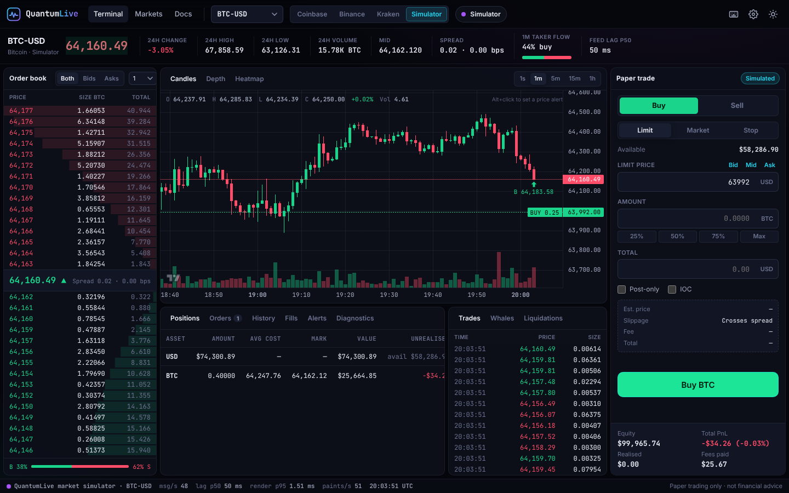
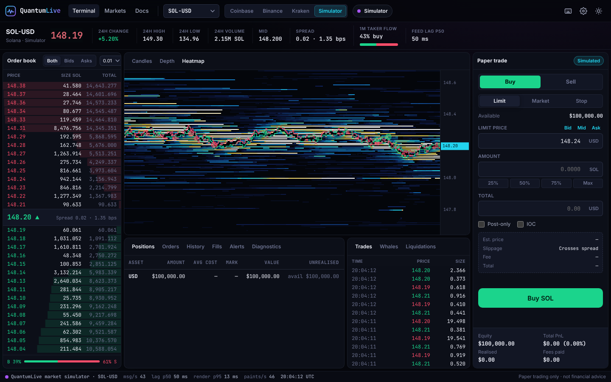
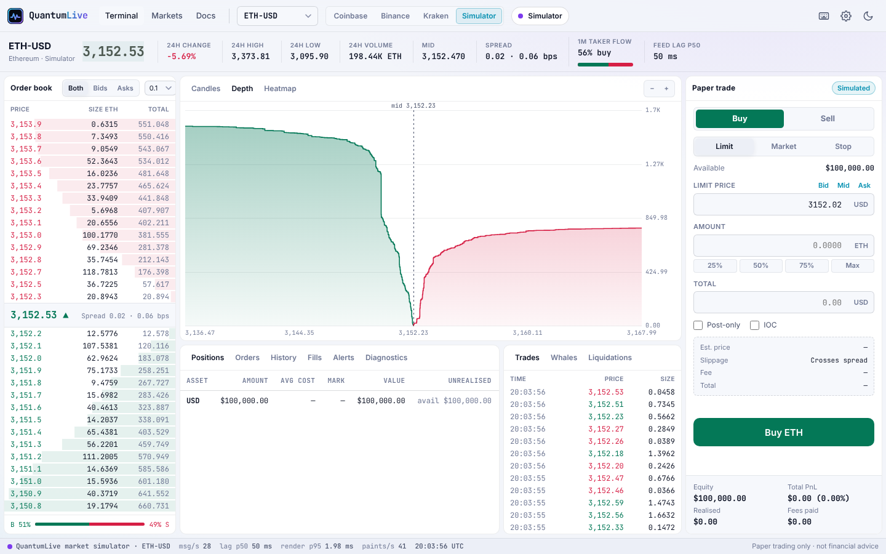
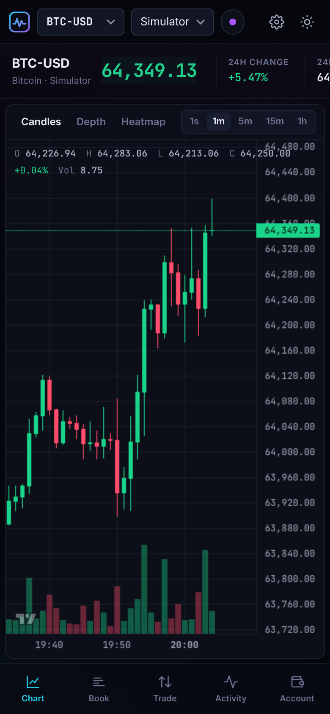
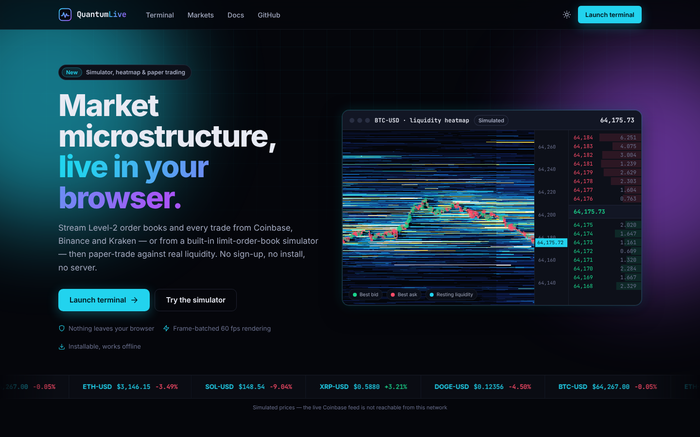

# QuantumLive

**Real-time market microstructure, live in your browser.** QuantumLive streams Level-2 order books and every trade from
Coinbase, Binance and Kraken — or from a built-in limit-order-book simulator — renders them as a professional trading
terminal, and lets you paper-trade against real liquidity. No sign-up, no server, no build step.



| Liquidity heatmap | Light theme · depth chart | Mobile |
| --- | --- | --- |
|  |  |  |

## Features

- **Live L2 order books** from Coinbase (`level2_batch`), Binance (`depth20@100ms`) and Kraken (WebSocket v2) with price
  grouping, cumulative depth bars, spread in bps and top-of-book imbalance.
- **Three chart views** — candles (1s → 1h, back-filled from each venue's REST API, local time zone), a zoomable cumulative
  **depth chart**, and a Bookmap-style **liquidity heatmap** with best bid/ask lines and trade bubbles.
- **Paper-trading engine** — market, limit (post-only / IOC) and stop orders that walk the real book: VWAP fills, slippage
  and fee estimates, reserved funds, average-cost PnL, fill markers and order lines on the chart. Persists locally.
- **Market microstructure simulator** — power-law depth decay, mean-reverting (OU) spread that widens with volatility,
  stochastic volatility with jumps, Hawkes-clustered order flow with Pareto sizes, square-root impact and liquidation
  cascades. Deterministic per seed; used automatically when a venue is unreachable.
- **Latency monitor** — p50/p95/p99/max for feed lag, parse, apply and render stages plus frame intervals, histograms,
  message/event rates and a connection log.
- **Whales, liquidations & alerts** — large prints highlighted, Binance USDⓈ-M liquidations streamed live, price alerts
  (<kbd>Alt</kbd>+click the chart).
- **Resilient feeds** — exponential backoff with jitter, alternate endpoints, stale-stream watchdog, crossed-book resync,
  and automatic fallback to the simulator.
- **Fast** — a frame scheduler repaints each view at most once per display refresh, however many messages arrive; the
  order book reuses a fixed pool of rows.
- **Polished UX** — dark/light themes, responsive layout down to phones (app-style tab bar), keyboard shortcuts
  (<kbd>?</kbd>), shareable deep links, toasts, settings.
- **Installable PWA** that works offline (on the simulator).
- **Locked down** — strict Content-Security-Policy on every page (no inline scripts or styles, no third-party hosts
  except the exchange APIs), all exchange data written with `textContent`, fonts and chart library self-hosted.

## Pages

| Page | What it is |
| --- | --- |
| [`index.html`](index.html) | Landing page with a live simulated heatmap, ticker strip, features, architecture and simulator overview |
| [`terminal.html`](terminal.html) | The trading terminal |
| [`markets.html`](markets.html) | Market overview: prices, 24h change/range/volume, sparklines, sorting, watchlist |
| [`docs.html`](docs.html) | Full documentation: data sources, paper-trading rules, simulator math, latency methodology, shortcuts, FAQ |
| [`404.html`](404.html) | Not-found page that works at any nested path on GitHub Pages |



## Quick start

The site is plain HTML, CSS and native ES modules. Browsers refuse to load modules from `file://`, so serve the folder:

```bash
npm start                 # zero-dependency dev server → http://localhost:8080
# or
python3 -m http.server 8080
```

Deep links: `terminal.html?symbol=ETH&exchange=kraken&tf=300` (`symbol` ∈ BTC ETH SOL XRP DOGE, `exchange` ∈ coinbase
binance kraken sim, `tf` ∈ 1 60 300 900 3600).

### Deploy to GitHub Pages

*Settings → Pages → Build and deployment → Deploy from a branch*, pick the branch and `/ (root)`. There is nothing to
build; all paths are relative, so the site works under `/<repo>/`. Social-preview scrapers require absolute URLs, so
once you know the deployed origin, make the `og:image` URL in `index.html` absolute.

## Project structure

```
index.html  terminal.html  markets.html  docs.html  404.html
sw.js                    network-first service worker (offline support)
manifest.webmanifest     PWA manifest
assets/
  css/                   base.css (tokens, components) · terminal.css · site.css
  fonts/                 Inter + JetBrains Mono (latin, variable, OFL)
  icons/  img/           PWA icons, SVG sprite, Open Graph image
  js/
    boot.js              pre-paint theme + file:// warning (classic script)
    core/                config, formatting, storage, seeded RNG, emitter
    feeds/               WebSocket base, Coinbase/Binance/Kraken adapters, pure
                         normalisers, REST history, feed manager, multi-ticker, sim feed
    market/              order book (sorted levels), candles, market model
    sim/                 market microstructure simulator
    trading/             paper-trading engine, price alerts
    metrics/             latency monitor (ring buffers, percentiles, rates)
    ui/                  order book, candle/depth/heatmap charts, tape, ticket,
                         account, diagnostics, scheduler, theme, toasts, sparkline
    pages/               one entry module per page
vendor/lightweight-charts/   TradingView Lightweight Charts™ 5.2.1 (Apache-2.0)
scripts/                 dev server, asset generator (icons, OG image, screenshots)
tests/                   unit + site-integrity tests (node:test), e2e/ browser smoke test
```

### Data flow

```
venue WebSocket ─┐
                 ├─► feed adapter ─► normalised events ─► Market (book · tape · candles · ticker)
simulator ───────┘   (backoff,          │                     │
                      fallback)         │                     ├─► frame scheduler ─► views
                                        │                     ├─► paper engine (fills, PnL)
                               latency probes                 └─► price alerts
```

Every adapter emits the same event shapes (`book` snapshot/delta, `trade`, `ticker`, `liquidation`), so all views, the
paper engine and the latency monitor behave identically on live data and on the simulator.

## Data sources

| Venue | Endpoint | Channels |
| --- | --- | --- |
| Coinbase Exchange | `wss://ws-feed.exchange.coinbase.com` | `level2_batch`, `matches`, `ticker`, `heartbeat` |
| Binance Spot | `wss://stream.binance.com:9443/stream` (fallback `data-stream.binance.vision`) | `@depth20@100ms`, `@aggTrade`, `@ticker` |
| Kraken | `wss://ws.kraken.com/v2` | `book` (depth 25), `trade`, `ticker` |
| Binance USDⓈ-M | `wss://fstream.binance.com/ws/<sym>@forceOrder` | liquidations |

Candle history: Coinbase `/products/<id>/candles`, Binance `/api/v3/klines`, Kraken `/0/public/OHLC`. All public and
unauthenticated; connections go straight from the browser to the venue. Trade `side` is always the taker side.

## The simulator

`assets/js/sim/market-sim.js` — see [docs.html#simulator](docs.html#simulator) for the full model and parameters.

| Component | Model |
| --- | --- |
| Fair price | GBM with log-OU stochastic volatility and Poisson jumps |
| Spread | OU in ticks, mean ∝ volatility^γ; sweeps open gaps refilled after Exp(τ) |
| Depth | size `q(d) ∝ (1 + d/x₀)^−α` × lognormal noise; heavy-tailed arrival distances; walls on round prices |
| Order flow | Hawkes arrivals (branching ratio 0.6), Pareto notional, momentum-tilted side |
| Impact | market orders walk the book; permanent impact `k·√(Q/Q_touch)` bps |
| Liquidations | forced orders after > 2.2σ moves over 15 s, executed as market orders (cascades) |

## Latency monitor

Stages are recorded into 1,024-sample ring buffers: **feed lag** (exchange timestamp → receipt, includes clock offset),
**parse**, **apply**, **render** (work per animation frame) and **frame interval**. Note that browsers coarsen
`performance.now()` to ~100 µs (≈5 µs when cross-origin isolated), so figures are reported in µs/ms — sub-microsecond
precision is not achievable in a browser.

## Testing

```bash
npm test             # unit + site-integrity tests, zero dependencies (node:test)
npm run test:e2e     # headless Chromium smoke tests (npm ci && npx playwright install chromium)
npm run assets       # regenerate PWA icons, OG image and README screenshots
```

- **Unit tests** cover the order book (incl. a 20k-operation randomised consistency check), candles, the paper engine
  (VWAP walks, maker/taker fills, reservations, stops, PnL, persistence), price alerts, latency statistics, formatting,
  exchange message normalisers (fixtures from each venue's docs) and REST history parsers.
- **Simulator tests** assert its invariants: determinism, never-crossed books, deltas that reproduce the internal book
  exactly, tick-grid prices, depth decaying away from mid, clustered and heavy-tailed trade flow, spread mean reversion.
- **Integrity tests** check every page has a CSP and no inline script/style, every local reference and module import
  resolves, the service worker precaches exactly the shipped files, and the CSP allows every feed endpoint.
- **Browser smoke tests** load every page on desktop and mobile widths (no console errors, CSP violations or horizontal
  overflow) and drive the terminal: streaming, market and limit orders, cancel, rejections, chart views, theme and market
  switching.

CI runs all of the above on every push and pull request (`.github/workflows/ci.yml`).

## Privacy

No backend, analytics, trackers or third-party fonts/CDNs. Settings, the paper account, alerts and the watchlist live in
`localStorage` under keys prefixed `qlive.`.

## Disclaimer

Market data comes from the exchanges' public APIs and may be delayed or incomplete. Some venues are unavailable in some
regions (e.g. Binance in the US); the terminal then falls back to the simulator. Paper trading is simulated locally — no
order is ever sent to an exchange. Nothing here is financial advice.

Third-party components and their licenses are listed in [THIRD_PARTY_NOTICES.md](THIRD_PARTY_NOTICES.md).
